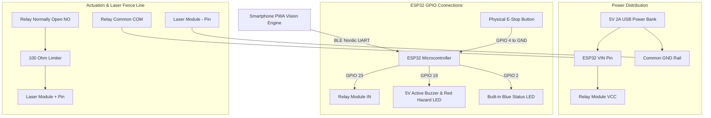

# FenceGuard AI: Hardware Interconnect & Breadboard Guide
## Smart Laser Light Fence Safety System for School Science Exhibition

This guide provides the complete hardware wiring instructions, pin tables, and schematic designs for building the **FenceGuard AI** physical prototype using an **ESP32 microcontroller**, **5V Relay Module**, **Active Buzzer**, **Indicator LEDs**, and **Laser Diode Modules** simulating the electric fence perimeter.

---

## 1. Safety Standard for Exhibition & Jury Evaluation

> [!CAUTION]
> **Zero High-Voltage Hazard (Exhibition Safe):**
> Real agricultural fence energizers discharge 5,000V to 10,000V in brief, high-energy pulses that can be hazardous or cause severe electrical shock. In compliance with safety rules for school and collegiate science exhibitions, **no real high-voltage energizers should be used**.
>
> Instead, this system uses **5V Laser Diode Modules (e.g., KY-008 650nm 5mW Red Lasers)** switched by the 5V relay. When energized (ARMED), visible laser beams shoot across the model perimeter representing the active fence. When a human is detected, the relay cuts power to the lasers instantly ("SAFE TRIP"). This provides a stunning, high-tech, futuristic visual presentation that is **100% safe to touch for judges, teachers, and students**.

---

## 2. Bill of Materials (BOM)

| Component | Quantity | Specifications / Model | Purpose |
| :--- | :--- | :--- | :--- |
| **ESP32 Dev Board** | 1 | 30-pin or 38-pin NodeMCU-32S / ESP-WROOM-32 | BLE Server & Actuator Controller |
| **5V Relay Module** | 1 | 1-Channel Optoisolated Relay (Songle 5V DC) | High-side power switch for Laser Fence |
| **Laser Diode Modules** | 1 to 4 | 5V 650nm 5mW Red Laser (KY-008) or Laser Pointers | Visual representation of fence perimeter |
| **100Ω Resistor** | 1 to 4 | 100Ω 1/4W Resistor (optional for laser protection) | Thermal current limiter for long exhibition runs |
| **Active 5V Buzzer** | 1 | 5V Piezo Active Buzzer | Audible hazard warning siren |
| **Warning Strobe LED** | 1 | 5mm High-Brightness Red LED + 220Ω Resistor | Visual danger strobe when tripped |
| **Push Button (E-Stop)**| 1 | Standard 6mm tactile momentary push button | Physical manual emergency trip override |
| **Small Mirrors / Prisms** | 2 to 4 | 2cm x 2cm craft mirrors (optional) | To bounce laser beam around perimeter |
| **Solderless Breadboard**| 1 | Standard 830-point or 400-point breadboard | Circuit interconnect |
| **Jumper Wires** | ~20 | Male-to-Male, Male-to-Female dupont wires | Interconnections |
| **Power Supply** | 1 | 5V 2A USB Phone Charger or Power Bank | Powers ESP32, Relay & Lasers |

---

## 3. Circuit Architecture & Block Diagram



---

## 4. Master Pin Interconnect Table

### A. ESP32 to 5V Relay Module
| ESP32 Pin | Relay Module Pin | Wire Color (Rec.) | Description |
| :--- | :--- | :--- | :--- |
| **VIN (or 5V)** | **VCC** | Red | Provides 5V power to the relay coil & optocoupler |
| **GND** | **GND** | Black | Ground reference |
| **GPIO 23** | **IN (Signal)** | Yellow / White | Logic control from ESP32 (Active LOW) |

> [!NOTE]
> Most 1-channel relay modules have a 3-pin jumper connecting `VCC` and `JD-VCC`. Keep this jumper in place for single 5V power supply operation.

---

### B. Relay Module to Laser Diode Fence Line
The relay operates as a switch on the positive power line of the laser diodes.

| Connection Source | Relay Terminal | Connection Destination | Notes |
| :--- | :--- | :--- | :--- |
| **5V Rail (ESP32 VIN)** | **COM (Common)** | Center screw terminal | 5V supply line enters relay switch |
| **Relay NO Terminal** | **NO (Normally Open)** | **Laser Diode (+) Pin** | Power only flows when Relay is ENERGIZED |
| **Common GND Rail** | *(Direct connection)* | **Laser Diode (-) Pin** | Laser cathode connected to Ground |

*Why Normally Open (NO)?*  
If ESP32 loses power or firmware crashes, the relay de-energizes into its default open position, cutting power to the laser fence. This is **fail-safe by design**.

---

### C. ESP32 to Buzzer & Warning LED
| ESP32 Pin | Component Pin | Notes |
| :--- | :--- | :--- |
| **GPIO 19** | **Buzzer (+) / Long Leg** | Connects to positive terminal of 5V Active Buzzer |
| **GND** | **Buzzer (-) / Short Leg** | Connects to common ground |
| **GPIO 19** | **Red LED Anode (+)** | Via **220Ω resistor** in series |
| **GND** | **Red LED Cathode (-)** | Connects to common ground |

*(Note: The Buzzer and Warning LED can be wired in parallel from GPIO 19 to GND).*

---

### D. Onboard Status LED (Built-in)
| ESP32 Pin | Component | Function |
| :--- | :--- | :--- |
| **GPIO 2** | Built-in Blue LED | **Fast Blink (150ms):** BLE Advertising (Waiting for phone)<br>**Solid ON:** Connected & Armed<br>**Slow Pulse (400ms):** Safe Trip Activated |

---

### E. Physical Emergency Stop (E-Stop) Button (Optional Manual Override)
| ESP32 Pin | Component Pin | Notes |
| :--- | :--- | :--- |
| **GPIO 4** | **Push Button Terminal 1** | ESP32 uses internal `INPUT_PULLUP` resistor |
| **GND** | **Push Button Terminal 2** | Pressing button connects GPIO 4 to GND, instantly tripping the fence |

*Why an E-Stop Button?*  
In agricultural and industrial machinery, physical fail-safe redundancy is mandatory. If the smartphone runs out of battery, drops, or an emergency arises during jury evaluation, pressing this tactile button cuts the laser fence instantly independent of software.

---

## 5. Breadboard Wiring Diagram (ASCII Schematic)

```
           +--------------------------------------------+
           |           5V 2A USB POWER SUPPLY           |
           +--------------------+-----------------------+
                                | 5V (Red)
                                | GND (Black)
                                v
+=========================== BREADBOARD POWER RAILS ============================+
| (5V BUS +)  o---o---o---o---o---o---o---o---o---o---o---o---o---o---o---o     |
| (GND BUS -) o---o---o---o---o---o---o---o---o---o---o---o---o---o---o---o     |
+===============================================================================+
        |                 |               |                      |
        | 5V              | GND           | 5V                   | GND
        v                 v               v                      v
  +-----------+     +-----------+   +-----------+          +-----------+
  | ESP32 VIN |     | ESP32 GND |   | RELAY VCC |          | RELAY GND |
  +-----------+     +-----------+   +-----------+          +-----------+
        |
        +-- GPIO 23 ----------------------> RELAY IN
        |
        +-- GPIO 19 ----+----[ 220Ω ]-----> [Red LED Anode] ---> (GND)
        |               |
        |               +-----------------> [Buzzer (+)] ------> (GND)
        |
  [Built-in LED: GPIO 2]

                       --- RELAY HIGH-VOLTAGE / LASER TERMINALS ---
                       
                            [ 5V Power Rail (+) ]
                                      |
                                      v
                             +-----------------+
                             |    RELAY COM    |
                             +-----------------+
                                      |  (Switch Contact)
                             +-----------------+
                             |    RELAY NO     |
                             +-----------------+
                                      |
                         Switched 5V  | (Active ONLY when ARMED)
                                      v
                             +-----------------+
                             |  LASER DIODE +  | (KY-008 650nm)
                             |                 |
                             |  LASER DIODE -  | ---> [ Common GND Rail (-) ]
                             +-----------------+
                                      |
                                      | (Visible Red Beam)
                                      v
                              [ Perimeter Fence ]
                              [ Mirror 1 -> Mirror 2 ]
```

---

## 6. Model Fence Construction Ideas for Exhibition

For the science exhibition booth:
1. **The Fence Posts:**  
   Cut 4 wooden craft dowels or 3D-printed miniature fence posts (15 cm tall). Mount them at the four corners of a cardboard or plywood model farm field (e.g., 40 cm × 30 cm).
2. **Mounting the Laser:**  
   Hot-glue the KY-008 laser module on Post #1 pointing toward Post #2.
3. **Corner Mirrors:**  
   Attach small craft mirrors (2 cm × 2 cm) at 45-degree angles on Posts #2 and #3 to redirect the laser beam across all four boundaries back to Post #4, creating a continuous optical laser perimeter!
4. **The Camera Stand:**  
   Place the smartphone in a vertical stand positioned approximately 30 cm to 50 cm away, with the camera angled to view the perimeter gate.
5. **Demonstration Props:**  
   - Place a plastic toy cow or printed photo of an animal in front of the gate: The laser beams **remain energized (ARMED)**.
   - Move your hand or a human figure near the fence: The relay **clicks open instantly**, the laser lights **shut off**, and the phone/ESP32 sounds the **emergency siren**!

---

## 7. Hardware Troubleshooting & Sanity Checks

| Symptom | Probable Cause | Quick Solution |
| :--- | :--- | :--- |
| **Relay LED lights up, but laser does not turn ON** | Relay wired to `NC` instead of `NO`, or laser polarity reversed | Move wire to `NO` terminal. Ensure Laser `S` or `+` is on relay output, and `-` is on GND. |
| **Relay behavior is inverted (ON when tripped, OFF when armed)** | Relay board is Active HIGH instead of Active LOW | Change `#define RELAY_ACTIVE_LOW false` in `esp32_firmware.ino` and re-upload. |
| **ESP32 reboots continuously when relay clicks** | Voltage drop (brownout) on ESP32 USB rail | Use a 2A dedicated USB phone charger or power bank instead of an unpowered PC USB hub. |
| **Buzzer makes click sounds instead of loud siren** | Passive buzzer used instead of Active buzzer | Ensure you use a 5V *Active* buzzer (has internal oscillator), or use a standard LED strobe. |
| **Laser beam is too dim in bright room** | Ambient room light scattering beam | Add a light mist or slight chalk dust / smoke effect in a clear display box for a spectacular beam effect! |
